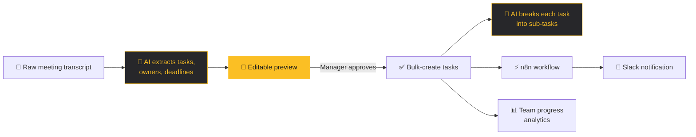

<div align="center">


<a href="https://github.com/bttu2002">
  
</a>

<br/>


<br/><br/>

<a href="mailto:bttu2002@gmail.com"></a>
<a href="https://www.linkedin.com/in/bttu2002"></a>
<a href="tel:0935648545"></a>
<a href="https://micro-do-fe.vercel.app/dashboard"></a>

</div>

<br/>

## 👋 About me

```ts
const tu = {
  role:        "Fullstack Developer & System Operator @ The Scaling Engine",
  strongest:   ["React", "TypeScript", "Tailwind", "Zustand"],
  comfortable: ["Node.js", "Express", "REST APIs", "Supabase / PostgreSQL"],
  exploring:   ["n8n workflow automation", "AI-assisted features"],
  education:   "Software Engineering, FPT University (2021 – 2025)",
  direction:   "Using dev experience to automate and optimize infrastructure",
  lookingFor:  "Junior / Fresher Frontend or Fullstack role",
};
```

<table>
<tr>
<td width="33%" valign="top">

**🧑‍⚖️ Human in the loop**

AI drafts, people approve. My tools put a review step before anything gets written, so automation saves time without losing control.

</td>
<td width="33%" valign="top">

**⚙️ Automate the boring part**

If a manager types the same thing twice a week, it should be a workflow. I reach for n8n, webhooks and Slack before adding another screen.

</td>
<td width="33%" valign="top">

**📦 Ship end to end**

API, UI, integration, deployment. I'm most comfortable owning a feature from the first endpoint to the dark mode toggle.

</td>
</tr>
</table>


## 💼 Experience

<table>
<tr>
<td width="120" align="center" valign="top">

</td>
<td valign="top">

**Fullstack Developer & System Operator** at **The Scaling Engine** · Remote

Developing and maintaining internal tools and customer-facing applications, and keeping the SaaS platforms and automated workflows behind them stable and optimized.

</td>
</tr>
<tr>
<td width="120" align="center" valign="top">

</td>
<td valign="top">

**Software Engineering Intern** at **FPT Software** · Full-time

Labeled and prepared AI training datasets with LabelMe, worked inside a professional team workflow and saw the full software development lifecycle up close.

</td>
</tr>
</table>


## ⭐ Featured project: MicroDo

<p>
<a href="https://micro-do-fe.vercel.app/dashboard"></a>
</p>

> **The problem.** After every meeting, managers re-type the same decisions into a task board by hand. Breaking a vague task into real steps is just as manual, and once work is handed out nobody has a clear view of who is actually moving.

**How MicroDo turns a meeting into a working task board:**



| What I built | What it replaces |
|---|---|
| **Transcript → tasks pipeline** with an editable approval preview | A typing session after every meeting becomes a two-minute review |
| **AI task decomposition** at creation time | Work starts from actionable steps, not a vague one-liner |
| **Multi-project team management** with productivity analytics | "Who's working on what?" check-ins |
| **n8n → Slack automation** for task events | Asking the team to keep refreshing the board |
| **REST API + responsive UI** with dark / light mode | Built end to end by me |

<p>


</p>


## 📁 More projects

<table>
<tr>
<td width="50%" valign="top">

### 🍱 CEO Dashboard
**Restaurant management system**

RESTful API plus a fully responsive UI for every device, with the frontend and backend integration handled end to end.

<a href="https://demo.wayer.co"></a>

<sub>React · TypeScript · Node.js · Express · Supabase</sub>

</td>
<td width="50%" valign="top">

### 🌏 BEESRS (Capstone)
**Social recommendation system for Broadcom expat employees**

Interactive UI for discovering places and meeting people, map features through the TrackMaps API, plus chat and event management components.

<a href="https://beesrs.io.vn"></a>
<a href="https://github.com/bttu2002/CapstoneProject_FA25_FE"></a>

<sub>React · TypeScript · REST API · TrackMaps API</sub>

</td>
</tr>
<tr>
<td width="50%" valign="top">

### 📰 NewsFlow
**Real-time news platform**

A small intermediate backend that sidesteps CORS errors in production, and a responsive desktop and mobile UI with search and dark / light mode.

<a href="https://news-flow-tau.vercel.app"></a>
<a href="https://github.com/bttu2002/NewsFlow"></a>

<sub>React · TypeScript · Vite · Axios</sub>

</td>
<td width="50%" valign="top">

### 📈 TradersYa
**Real-time crypto tracker**

Live trending coin data from the CoinLore API, served through an intermediate backend to avoid CORS, with search and dark / light mode.

<a href="https://traders-ya.vercel.app"></a>
<a href="https://github.com/bttu2002/TradersYa"></a>

<sub>React · TypeScript · Tailwind · CoinLore API</sub>

</td>
</tr>
</table>


## 🛠 Tech stack

<table>
<tr>
<td width="140"><b>Frontend</b></td>
<td>
<br/>


</td>
</tr>
<tr>
<td><b>Backend</b></td>
<td>
<br/>


</td>
</tr>
<tr>
<td><b>Database</b></td>
<td>
<br/>


</td>
</tr>
<tr>
<td><b>Automation</b></td>
<td>


</td>
</tr>
<tr>
<td><b>Tools & deploy</b></td>
<td>
<br/>


</td>
</tr>
</table>


## 📊 On GitHub

<p align="center">
  
  
</p>

<p align="center">
  
</p>

<p align="center">
  
</p>

<p align="center">
  
</p>

<p align="center">
  
</p>


<div align="center">

**Hiring a Junior / Fresher Frontend or Fullstack developer?** I'd love to hear about it.

<a href="mailto:bttu2002@gmail.com"></a>
<a href="https://www.linkedin.com/in/bttu2002"></a>

</div>
