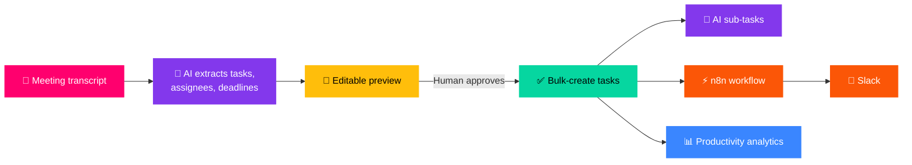

  
  
  

  
  
  
  

<table>
<tr>
<td width="33%" valign="top">
  
Information Technology, Software Engineering 
<b>FPT University</b> (2021 – 2025)
</td>
<td width="33%" valign="top">
  
<b>Ho Chi Minh City</b>
</td>
<td width="33%" valign="top">
  
<b>English</b> and <b>Vietnamese</b>
</td>
</tr>
<tr>
<td valign="top">
  
<b>Fullstack Developer</b>, strong on frontend (React, TypeScript), working knowledge of backend (Node.js, REST APIs)
</td>
<td valign="top">
  
Frontend-focused Fullstack Developer transitioning toward <b>System Operations</b>, using dev experience to automate and optimize infrastructure
</td>
<td valign="top">
  
<b>n8n</b> workflow automation and <b>AI-assisted</b> features
</td>
</tr>
</table>

<table>
<tr>
<td width="150" align="center" valign="top">

</td>
<td valign="top">

### 🧭 Fullstack Developer | System Operator
 

🟣 Developed and maintained internal tools and customer-facing applications 
🔵 Managed and optimized SaaS platforms, ensuring stability of automated workflows

</td>
</tr>
<tr>
<td width="150" align="center" valign="top">

</td>
<td valign="top">

### 🧭 Software Engineering Intern
 

🟠 Labeled and prepared datasets for AI model training using LabelMe 
🟡 Worked within a professional dev environment and team project workflows 
🟢 Gained hands-on experience with the full software development lifecycle

</td>
</tr>
</table>

## ⭐ Task Management SaaS System (MicroDo)

> 🔴 **The problem:** After every meeting, managers re-type the same decisions into a task board by hand — who owns what, by when. Breaking a vague task into actionable steps is equally manual, and once work is distributed there is no clear view of who is actually progressing.

**What I built to solve it:**

🟣 **Meeting transcript → tasks pipeline:** managers paste a raw transcript and AI extracts structured tasks with assignees and deadlines, rendered in an editable preview so a human approves before anything is written, then bulk-creates the approved set. Turns post-meeting data entry into a review step instead of a typing session.

🔵 **AI task decomposition:** complex tasks are automatically broken into sub-tasks at creation time, so work starts from actionable steps rather than a vague one-liner.

🟢 **Multi-project team management:** managers add members to projects, track individual progress, and read productivity analytics, replacing "who's working on what?" check-ins with a live view.

🟠 **Automated notifications via n8n:** workflow automation pushes task events to Slack, so updates reach the team where they already work instead of requiring them to check the board.

🟡 Built the **RESTful API** and a **responsive UI** with Dark/Light mode end-to-end.

 

<table>
<tr>
<td width="50%" valign="top">

### 📰 NewsFlow

🔸 Built an intermediate backend to prevent CORS errors during deployment 
🔸 Responsive UI for desktop and mobile with search + dark/light mode

</td>
<td width="50%" valign="top">

### 📈 TradersYa

🔸 Built an intermediate backend to prevent CORS errors during deployment 
🔸 Live trending coin data with search and dark/light mode

</td>
</tr>
<tr>
<td width="50%" valign="top">

### 🍱 CEO-Dashboard

🔸 Developed a RESTful API and a fully responsive UI for all devices 
🔸 Handled frontend–backend integration end-to-end

</td>
<td width="50%" valign="top">

### 🎓 Capstone Project

🔸 Built an interactive UI for location discovery and social interaction 
🔸 Integrated map features via TrackMaps API; built chat & event management components

</td>
</tr>
</table>

<table>
<tr>
<td width="130" align="center"></td>
<td>

</td>
</tr>
<tr>
<td align="center"></td>
<td>

</td>
</tr>
<tr>
<td align="center"></td>
<td>

</td>
</tr>
<tr>
<td align="center"></td>
<td>

</td>
</tr>
<tr>
<td align="center"></td>
<td>

</td>
</tr>
</table>

  
  

  

  

  

<h3 align="center">🐍 Commit Snake</h3>

  

💬 **Open to Fresher / Junior Frontend & Fullstack opportunities, feel free to reach out!**

