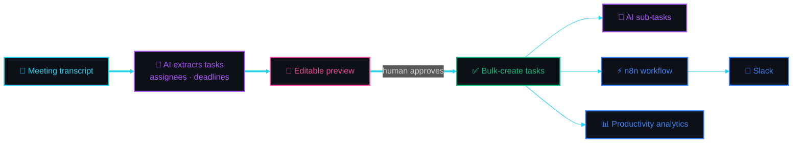

<!-- ============================== HERO ============================== -->

  
  
  

  
  
  
  

<!-- ============================== ABOUT ============================== -->

<table>
<tr>
<td width="33%" valign="top" align="center">
 
  
Information Technology Software Engineering 
<b>FPT University</b> 2021 – 2025
</td>
<td width="33%" valign="top" align="center">
 
  
<b>Ho Chi Minh City</b>
</td>
<td width="33%" valign="top" align="center">
 
  
<b>English</b> · <b>Vietnamese</b>
</td>
</tr>
<tr>
<td valign="top" align="center">
 
  
<b>Fullstack Developer</b> — strong on frontend (React, TypeScript), working knowledge of backend (Node.js, REST APIs)
</td>
<td valign="top" align="center">
 
  
Frontend-focused | Fullstack Developer transitioning toward <b>System Operations</b> — using dev experience to automate and optimize infrastructure
</td>
<td valign="top" align="center">
 
  
<b>n8n</b> workflow automation & <b>AI-assisted</b> features
</td>
</tr>
</table>

<!-- ============================== EXPERIENCE ============================== -->

<table>
<tr>
<td width="80" align="center" valign="top">

</td>
<td valign="top">

### Fullstack Developer | System Operator
  

▸ Developed and maintained internal tools and customer-facing applications 
▸ Managed and optimized SaaS platforms, ensuring stability of automated workflows

</td>
</tr>
<tr>
<td width="80" align="center" valign="top">

</td>
<td valign="top">

### Software Engineering Intern
  

▸ Labeled and prepared datasets for AI model training using LabelMe 
▸ Worked within a professional dev environment and team project workflows 
▸ Gained hands-on experience with the full software development lifecycle

</td>
</tr>
</table>

<!-- ============================== PROJECTS ============================== -->

<h2>

Task Management SaaS System (MicroDo)
</h2>

> [!IMPORTANT]
> **The problem:** After every meeting, managers re-type the same decisions into a task board by hand — who owns what, by when. Breaking a vague task into actionable steps is equally manual, and once work is distributed there is no clear view of who is actually progressing.

**What I built to solve it:**

<table>
<tr>
<td width="50%" valign="top">
 
Managers paste a raw transcript and AI extracts structured tasks with assignees and deadlines, rendered in an editable preview so a human approves before anything is written — then bulk-creates the approved set. Turns post-meeting data entry into a review step instead of a typing session.
</td>
<td width="50%" valign="top">
 
Complex tasks are automatically broken into sub-tasks at creation time, so work starts from actionable steps rather than a vague one-liner.
</td>
</tr>
<tr>
<td valign="top">
 
Managers add members to projects, track individual progress, and read productivity analytics — replacing "who's working on what?" check-ins with a live view.
</td>
<td valign="top">
 
Workflow automation pushes task events to Slack, so updates reach the team where they already work instead of requiring them to check the board.
</td>
</tr>
<tr>
<td colspan="2" align="center">
&nbsp;
Built the <b>RESTful API</b> and a <b>responsive UI</b> with <b>Dark/Light mode</b> end-to-end.
</td>
</tr>
</table>

 

<table>
<tr>
<td width="50%" valign="top">

<h3> NewsFlow</h3>

▸ Built an intermediate backend to prevent CORS errors during deployment 
▸ Responsive UI for desktop and mobile with search + dark/light mode

</td>
<td width="50%" valign="top">

<h3> TradersYa</h3>

▸ Built an intermediate backend to prevent CORS errors during deployment 
▸ Live trending coin data with search and dark/light mode

</td>
</tr>
<tr>
<td width="50%" valign="top">

<h3> CEO-Dashboard</h3>

▸ Developed a RESTful API and a fully responsive UI for all devices 
▸ Handled frontend–backend integration end-to-end

</td>
<td width="50%" valign="top">

<h3> Capstone Project</h3>

▸ Built an interactive UI for location discovery and social interaction 
▸ Integrated map features via TrackMaps API; built chat & event management components

</td>
</tr>
</table>

<!-- ============================== TECH STACK ============================== -->

<table>
<tr>
<td width="140" align="center">
 

</td>
<td>
 

</td>
</tr>
<tr>
<td align="center">
 

</td>
<td>
 

</td>
</tr>
<tr>
<td align="center">
 

</td>
<td>
 

</td>
</tr>
<tr>
<td align="center">
 

</td>
<td>
 

</td>
</tr>
<tr>
<td align="center">
 

</td>
<td>

</td>
</tr>
</table>

<!-- ============================== STATS ============================== -->

  
  

  

  

  

<h3 align="center">
 Trophies
</h3>

  

<h3 align="center">
 Commit Snake
</h3>

  

<!-- ============================== FOOTER ============================== -->

